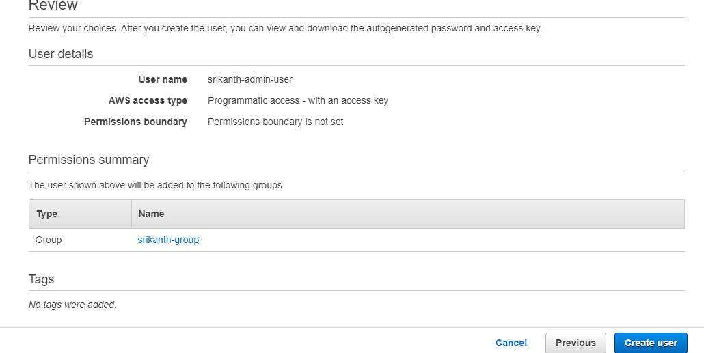

# springboot-dynamodb-example
Build CRUD Application using SpringBoot + DynamoDB then Deploy CRUD application to Elastic Beanstalk 


---

## Dependency (Required)

```xml
<dependency>
	<groupId>com.amazonaws</groupId>
	<artifactId>aws-java-sdk-dynamodb</artifactId>
	<version>1.11.815</version>
</dependency>
```

## Request JSON

```json
{
	"name":"Srikanth",
	"email":"srikanth@gmail.com",
	"age":20,
	"address":{
		"city":"Hyderabad",
		"state":"TS",
		"pinCode":"500050"
	}
}
```
#### Create a user and add user to user group and attach custom policy to this user group
```text
1) Go to IAM and create user group -- srikanth-group
2) give AdministratorAccess, AmazonEC2FullAccess to the above group
3) create a user srikanth-admin-user and give access type as Programmatic access
4) add user to srikanth-group
```
#### create policy srikanth-custom-policy
```text
create policy with below json
and attach this policy to our user group srikanth-group
```

## Custom Policy

```json
{
  "Version": "2012-10-17",
  "Statement": [
    {
      "Effect": "Allow",
      "Action":   [ "dynamodb:PutItem" ],
      "Resource": [ "*" ]
    },
    {
      "Effect": "Allow",
      "Action":   [ "sns:Publish" ],
      "Resource": [ "*" ]
    }
  ]
}
```
